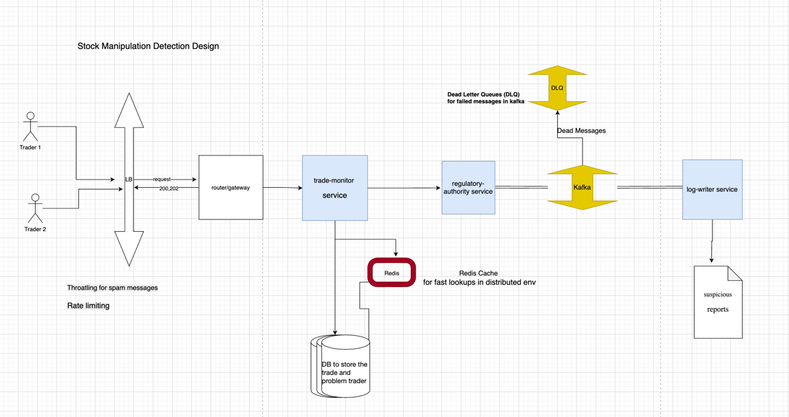

# StockWatch - Kafka Integration

# Requirements/Problem Statement:
It can be found at the root level of project with the file name as problem_statement.docx.

## 🔧 Prerequisites

- Java 17+
- Maven  3.9+
- Docker + Docker Compose

## 🚀 How to Run

1. Start Kafka & Zookeeper:
   If you have Docker installed, you can use the provided `docker-compose.yml` file to start Kafka and Zookeeper.
  if you are at root of the project, run:
   ```bash
    docker machine start
    docker-compose -f regulatory-authority/docker-compose.yml up -d
    ```
   if already running, you can stop it using:
   ```bash
    docker-compose -f regulatory-authority/docker-compose.yml down
    ```
   verify if Kafka and zookeeper is running:
   ```bash
    docker ps -a
    ```
2. It's a multi-module Maven project containing three services and one common module
3. Below are the three services and one common module in this project:
     - **trade-monitor**: A service that check the suspicious trades and notifies the regulatory authority.
     - **regulatory-authority**: The service that interacts with Kafka and produces the event.
     - **log-writer**: A service that consumes the events from Kafka and writes them to a log file.
     - **common**: A common module that contains shared code between the services.
4. Build the project using Maven:
   If you are at root of the project, run:
   ```bash
   mvn clean install
   ```
   This will build all the modules and create the necessary JAR files.
5. To run the services, navigate to each service's directory and run:
   - Please ensure you have kafka and zookeeper running before starting the services.
   - For **trade-monitor**:
     ```bash
     cd trade-monitor
     mvn spring-boot:run
     ```
   - For **regulatory-authority**:
     ```bash
     cd regulatory-authority
     mvn spring-boot:run
     ```
   - For **log-writer**:
     ```bash
     cd log-writer
     mvn spring-boot:run
     ```
6. H2 in memory database is used for the trade-monitor service. You can access it at:
    - URL: `http://localhost:8080/h2-console`
    - JDBC URL: `jdbc:h2:mem:stockwatchdb`
    - Username: `sa`
    - Password: (leave blank)
7. Swagger UI is available for the trade-monitor service at:
    - URL: `http://localhost:8080/swagger-ui.html`
    - API Docs: `http://localhost:8080/v3/api-docs`
8. you can access and call the trade-monitor service API at:
    - from Postman, URL: `http://localhost:8080/api/v1/trades`
    - Or call it from swagger UI
9. To test the integration, you can use the Swagger UI of the trade-monitor service to create trades. The regulatory authority will produce events to Kafka, and the log-writer will consume these events and write them to a log file.
10. All the endpoints of all the services are documented in Swagger UI. You can access it at:
    -  `http://localhost:8080/swagger-ui.html`
11. Log files for the log-writer service will be created in the `log-writer/suspicious-reports` directory. You can check these files to see the consumed events.
12. All the trade requests are stored in the H2 database of the trade-monitor service even if trader is already flagged. You can query the database to see the trades. 
    - Example query to see all trades:
      ```sql
      SELECT * FROM TRADE_STORE;
      ```
13. If trader is already flagged, the trade-monitor service will not notify the regulatory authority again. You can check the Swagger UI for the error response format.
14. In distrubuted environment, there is a possibility that the same trade can be processed by multiple instances of the trade-monitor service and it will try to notify the regulatory authority twice for the same trader. To avoid this, traderId is a unique contraint in the H2 database. If a trade with the same traderId is already present, it will not be processed again.
15. jmeter script is exported from the jmeter tool where i am running 100 threads to process 100 requests in 1 second. File is present at the root of the project with name `trades_load_test.jmx`. You can run it using the jmeter tool to test the performance of the trade-monitor service.

## 🚀 Production Notes - pending to be implemented
- For production use, consider using a more robust database instead of H2 with Partitioning.
- Consider using a distributed cache like Redis to store flagged traders and trade requests for the fast lookups for below scenarios:
  - If the trader is already flagged, the trade-monitor service will not notify the regulatory authority again.
  - The tradeCount is used to determine if the trader is suspicious or not. If the tradeCount is greater than 5, the trader is flagged.
- Use multiple partitions for the topic to enable parallel consumption and horizontal scaling. Partitioning can be based on nationality or traderId (hashed key) to ensure that trades from the same trader are processed by the same consumer instance. All messages with the same traderId go to the same partition
- Each service will be deployed as a separate microservice, possibly in a containerized environment like Docker or Kubernetes.
- There will be a routing service or API Gateway to route requests to the appropriate service. This will help in managing the services and scaling them independently in future also.
- Ensure proper logging in production.

## 📚 Architecture Diagram attached in the project root directory

